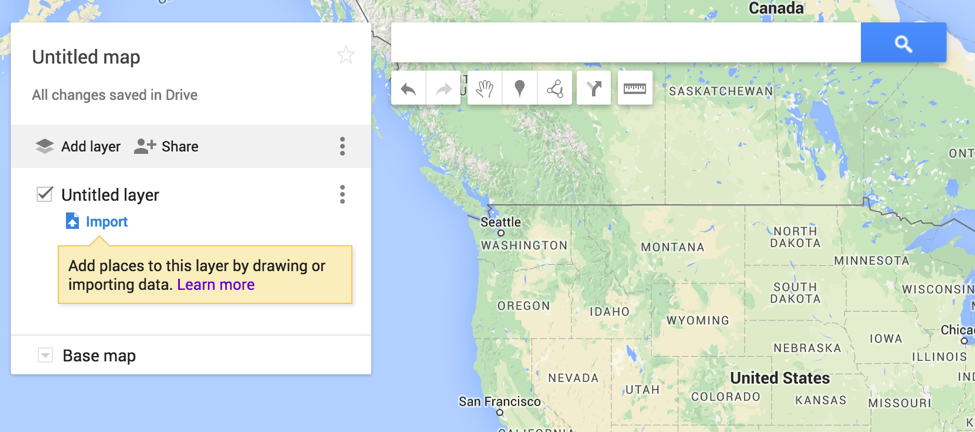
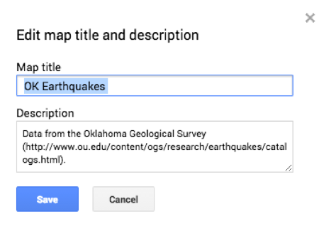

## About
Last Updated September 2016   
Created by [Sarah Clayton](https://github.com/sclayton29) and Jeffrey Widener

## Table of Contents
* [Introduction](#introduction)
* [Downloading the Data](#downloading-the-data)
* [Google Maps](#google-maps)
* [Google Fusion Tables](#google-fusion-tables)

## Introduction
This lesson will walk you through how to quickly create maps using google maps and google fusion tables. 
For this example, we will be mapping earthquakes in Oklahoma from 2015.  

[Return to Top](#about)

## Downloading the Data
For this exercise, you will need to create a Google account If you do not already have one. You can create an account at https://accounts.google.com/SignUp.

Today, we will use multiple tools to map Oklahoma earthquake data from 2010 and 2015. First, we need to download our data. We will use comma-separated values (CSV) files made available by the Oklahoma Geological Survey. 

First, navigate to the OGS’s website (http://www.ou.edu/ogs). In the navigation bar on the left side, click Earthquake Catalogs. This will take you to the list of available data. Click on 2015 and download the 2015.csv file. Repeat for the 2010 dataset. 

Examine the data. Some of the headers may make sense to you. Some may not. If you collapse the Earthquake Catalogs on the OGS website, you can click on Catalog Header Descriptions to see a description of each of the headers.  

*If this was your data, would you want to do any clean up work on it?* 

[Return to Top](#about)

## Google Maps

Now that we have our data, we can start making our map! Go to http://google.com/mymaps
Click Create a New Map. If you are not already signed into your Google account, this will take you to a log in page. Please sign into your account. 

You should now see a map of the United States (Google base map), search bar with icons across the top, and a white box (Mapbox) on the upper left. See image below.

Click on Untitled Map. This will open a dialog box for editing the map title and description. Enter OK Earthquakes as you title. You can put anything in the description, but I like to add my data source including the URL. Click save.

Now, click “Import” in your newly titled Map Box. 

This opens a dialog box for you to select your files. We want to import the 2015 OK Earthquake data. If you click “Select a file from your computer,” you can navigate to the 2015.csv (if you didn’t move this, it should be in your downloads folder). 

After you select your file, you will be prompted to choose columns to position your placemarks. These are the columns that the position of points on the map.  

Make sure latitude and longitude are checked. Click continue. 

Title your markers by county. Click Finish.  

You may have to wait a few moments for your file to import. 

Once the import has completed, in your Mapbox, you should see your file that you just imported. It’s now called a layer file. If you think of your map as a layer cake, the Google base map is your base, and you’ve just added a layer of sprinkles on top. 

Click Add layer and repeat the import process for your 2010.csv file. 

Notice you can uncheck the box beside the layer name to remove it from the map. 

The layer you just imported is given the same name as the file we uploaded by default. By clicking on the layer name, we can change it. Underneath 2015.csv, you can see that layer consist of 2,000 items. If you open the original csv file, you will notice that it has 5,776 rows. Google maps can only handle 2,000 records per layer. What we have really mapped is the first 2,000 records. This is important to remember when selecting a tool for your project. Our 2010 csv file only contains 1061 records so all of them are mapped. 

We can change the style to see how we can use the map to quickly answer questions about our data. You can repeat this exercise for 2010 and 2015. 

Click “Uniform style.” In the “Group places by” dropdown menu, select “county” in the “Style by data column.”

1. Which of your counties(top 3) had the most earthquakes?
2. Which of your couties (bottom 3) had the fewest earthquakes occur?
  
  
Switch your mapped style to 'prefmag.'
1. What magnitude was the largest earthquake? Where did this earthquake occur?
2. Describe the landscape around this large earthquake occurrence (this may require you to change your basemap). 
3. What’s the most common magnitude out of all of the earthquakes? 

Change your “prefmag” symbolization from categories to ranges and change it to show 5 ranges. You can change your range color preference in the option. Pick whatever makes the most sense to you. 

Before we move on, let’s look at one final feature. Under the search bar, there is a ruler icon. This will enable us to quickly measure distances. Click on the ruler. Then, click on one of your points. You can click on as many as many points as you would like. Double click to end your measurement. 

If you want to do more powerful geospatial analysis, you probably will want to switch to a different (or more complicated) tool like ArcGIS or QGIS. 

To share your map, click the Share button above your layer name. This will provide you with a link you can send to anyone and the opportunity to invite people to view or edit your map. 

[Return to Top](#about)

## Google Fusion Tables

[Return to Top](#about)
